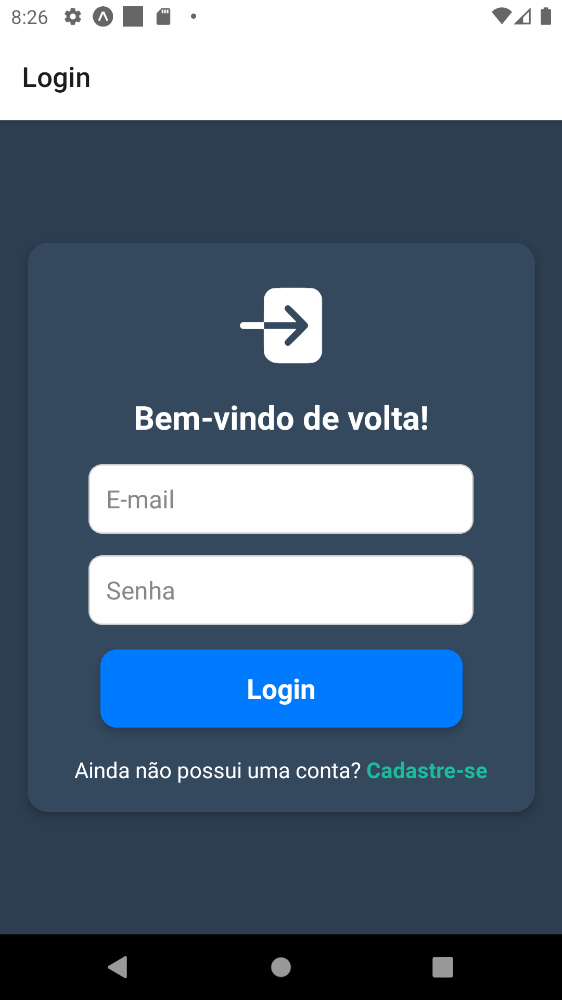
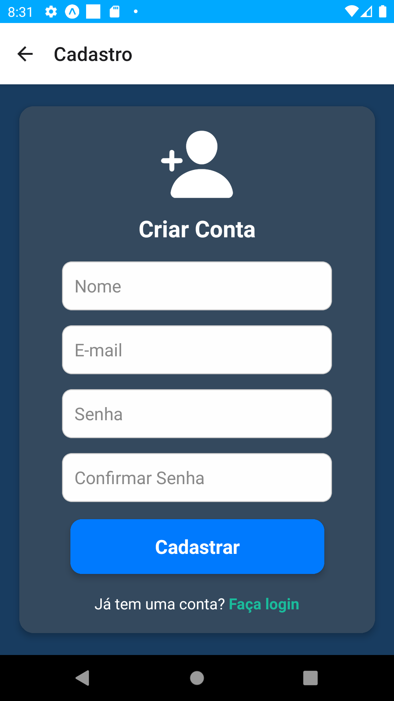
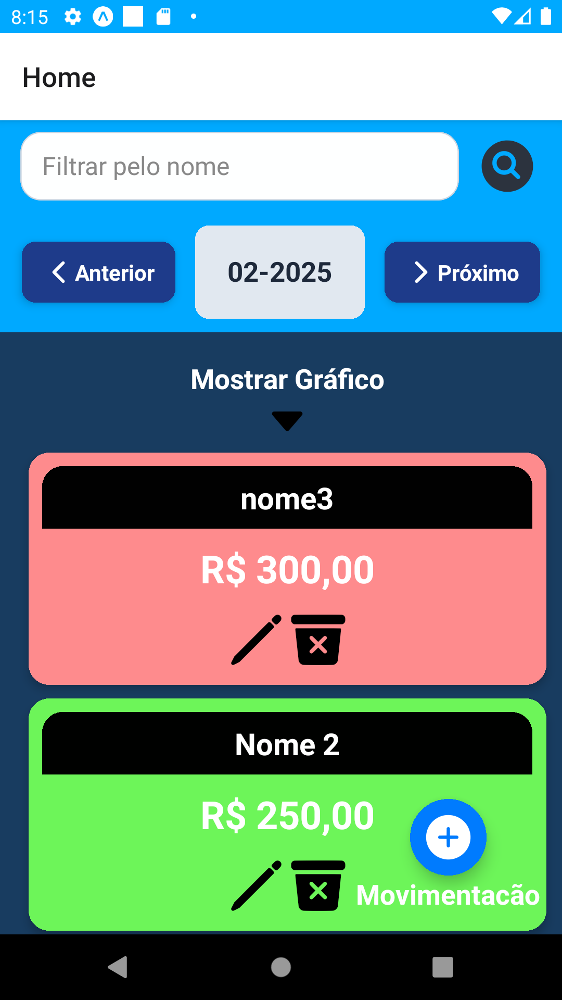
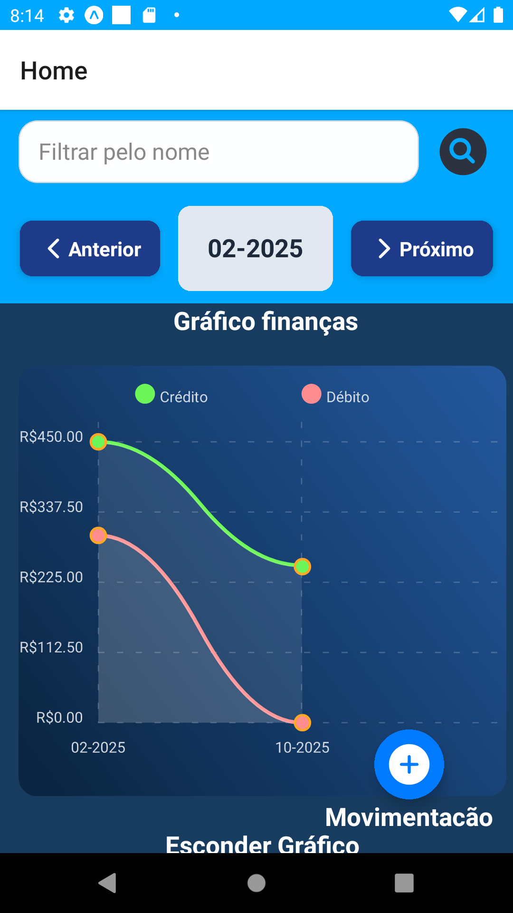
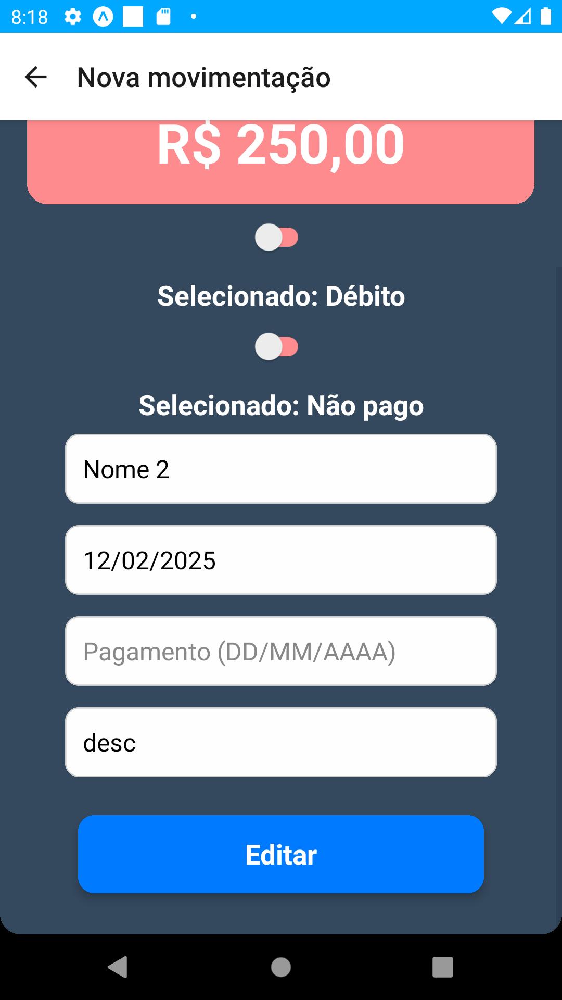

# Sobre o projeto
Projeto em react-native que realiza o cadastro, atualização, listagem e atualização de movimentacões armazenadas no firebase 

## 🛠️ Construído com

React-native 
javaScript
typescript
firebase 

## tela login:

## tela cadastro 

## tela principal 

## gráfico 

## tela cadastro/ atualização 

